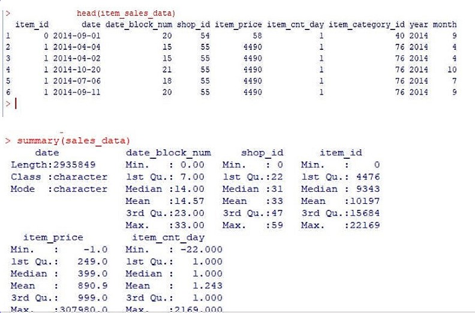
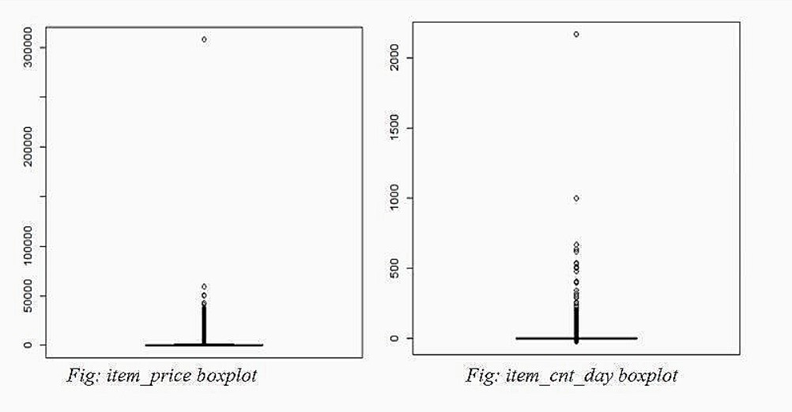
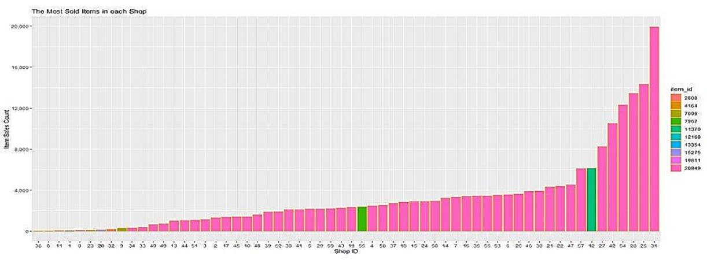

# Predict Future Sales - Kaggle challenge 

## Description
The goal is to predict total sales for every product and store in the next month. The data is a time-series dataset consisting of daily sales data, provided by one of the largest Russian software firms 1C company. https://www.kaggle.com/competitions/competitive-data-science-predict-future-sales

## Data Summary 
The sales_data and item_Sales data are in two different csv files so first step would be to merge them into one item_sales_data.

    

The mean of the item_price and item_cnt_day are very weird because the max values of both columns are too large than the mean. This means there are some outliers, and we need to do data cleaning before doing feature engineering.

## Data Cleaning 
We could see the negative values in item_price and item_cnt_day columns through summary. We started to check for missing values, negative values and outliers to clean the data

## Missing values
I checked for missing values in the dataset, but there were no missing values.

## Negative values

    

The negative values rows were removed from the dataset as the data was really big and the negative value rows were small in number, otherwise it should have replaced with 0 or mean.

## Outliers’ removal

    

From the above boxplots, we can find that the dataset also have some outliers in the item_price and item_cnt_day columns. Outliers got handled by removing the noisy data values/obvious outliers by defining some threshold. The data instances that sold more than 800 in one day and item with a price greater than 80,000 were removed

## Exploratory Data Analysis
After data cleaning, let's do data exploration and represent the data through some beautiful plots. Let's try to understand the data, which item has the most sales by the shop, which item is sold most by a shop, and which category of item is popular among people.

    
    

In the plots, we can see that shop number 31 sold the most item, similarly, item category 40 was most popular and 20949 item_id is the best seller or had the best sales.

## Experiment and Result 
For model training, the training data was divided into train and test sets, 70% train and 30% test. Then, trained the model using three methods. Since our problem is a regression problem we should use lm(), tree (), and gbm () methods. lm() and tree () are simple methods that’s why we chose them, and we chose gbm because Gradient Boosting Regression generally provides better accuracy. Our response variable is item count month and predictors are shop_id, item_id, month, year, and item_category_id. I also tried various combinations of predictors, but this combination worked best for me. You can try others as well.

    
    

## Conclusion
Out of the three models, gbm model’s root mean square error(rmse) was the lowest. Thus, the best model for our dataset. Then, with the gbm model we predicted our sales on test dataset and created a submission file.
